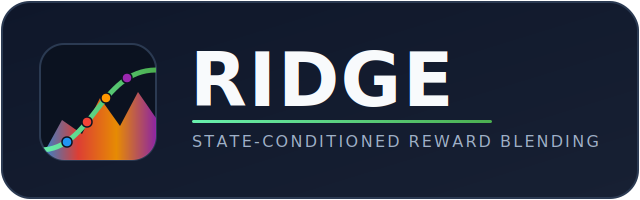
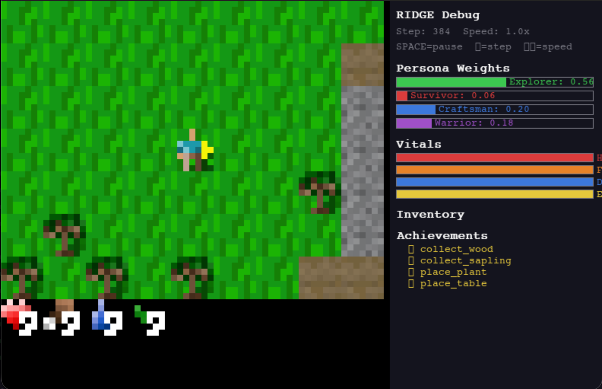

<div align="center">



# RIDGE: State-Conditioned Reward Blending for Behavioral Coverage in Deep RL Game Agents

**Kevin Christopher Chua · AL Muqshith Mohammed Shifan · Ali Neshati · Loutfouz Zaman · Cristiano Politowski**

Ontario Tech University


If RIDGE is useful for your work, please consider giving it a star. It helps others find the project.

[](https://github.com/Code-SorceryLab/RIDGE)

</div>

---

A single PPO agent blends **Explorer, Survivor, Craftsman, and Warrior** persona reward weights using smooth sigmoid functions conditioned on internal game state, so one agent shifts play style within an episode instead of training one agent per persona. Trained on the [Crafter](https://github.com/danijar/crafter) environment (22 achievements). RIDGE stands for Reactive Inter-persona Dynamic Goal Engine.

<details>
<summary><b>Demo: live viewer</b></summary>

The live viewer (menu option 6) renders the trained agent playing Crafter with a real-time debug overlay: the four persona weights, vitals, inventory, and unlocked achievements. The blend shifts as the agent's state changes.

<p align="center">
  
</p>

Full screen recording: [assets/ridge-demo.mov](assets/ridge-demo.mov)

</details>

<details>
<summary><b>Research questions and conditions</b></summary>

| | Question |
|---|---|
| RQ1 | Does state-conditioned blending match multi-persona ensemble coverage on Crafter's 22 achievements? |
| RQ2 | Does it do so at lower training compute (steps to coverage)? |
| RQ3 | Does smooth sigmoid blending avoid the switching-stability dilemma that hard switching causes? |

**Conditions:** RIDGE (adaptive, sharpness 1.0), four fixed-persona baselines (Explorer, Survivor, Craftsman, Warrior), an all-ones constant-reward sanity floor, and a sharpness ablation (sharpness 0.0, 0.5, 1.0, 1.5, 2.0). Budget: 1M Crafter steps per run.

</details>

<details>
<summary><b>Setup</b></summary>

```bash
pip install -r requirements.txt
```

Requires Python 3.10 or newer. Core dependencies: PyTorch, Crafter, TensorBoard, pygame, rich, NumPy, and Matplotlib. The full list is in `requirements.txt`.

On Windows, if `crafter` fails to build:

```powershell
$env:PYTHONUTF8="1"; pip install -r requirements.txt
```

</details>

<details>
<summary><b>Quick start (interactive menu)</b></summary>

```bash
python menu.py
```

| Key | Action | Key | Action |
|-----|--------|-----|--------|
| 1 | Train RIDGE | 9 | Evaluate checkpoint |
| 2 | Train Explorer | 10 | Sharpness sweep (RQ3) |
| 3 | Train Survivor | A | Train All-Ones (sanity floor) |
| 4 | Train Craftsman | L | Live Streamlit dashboard |
| 5 | Train Warrior | P | Post-training analysis (spider charts) |
| 6 | Live viewer | R | Full paper re-sweep (all conditions, N seeds) |
| 7 | TensorBoard | D | Delete checkpoints and logs |
| 8 | Comparison graphs | F | Fresh start (wipe everything) |

</details>

<details>
<summary><b>Command-line usage</b></summary>

```bash
# Train one condition (skips the menu)
python scripts/train.py --config configs/ridge_blend.yaml --seed 42

# Train with the live viewer
python scripts/train.py --config configs/ridge_blend.yaml --live

# Evaluate a checkpoint
python scripts/evaluate.py --config configs/ridge_blend.yaml \
    --checkpoint checkpoints/ridge_adaptive_seed42/best.pt --episodes 20

# Generate comparison plots from logs
python scripts/compare.py --logdir tensorboard_logs --out results

# Full multi-seed paper re-sweep (9 conditions x N seeds)
python scripts/run_multi_seed.py \
    --configs configs/ridge_sharp000.yaml configs/ridge_sharp050.yaml \
              configs/ridge_sharp100.yaml configs/ridge_sharp150.yaml \
              configs/ridge_sharp200.yaml configs/explorer.yaml \
              configs/survivor.yaml configs/craftsman.yaml configs/warrior.yaml \
    --seeds 1 2 3
```

</details>

<details>
<summary><b>Architecture</b></summary>

**Personas.** Four designer-authored reward functions, each scoring a transition from the perspective of its play style: Explorer (tile discovery and broad collection), Survivor (vital shaping over health, food, drink, energy plus survival milestones), Craftsman (the crafting tech tree), and Warrior (weapons and combat).

**State-conditioned blender.** Persona weights come from smooth sigmoid functions over a 6-dimensional state vector `[health, food, drink, energy, progress, tool_progress]`, normalized to a simplex so the four weights sum to 1. There are no hard switches: weights shift smoothly as state changes. The `blend_sharpness` parameter controls how abrupt the transitions are (0 collapses to a uniform mixture; larger values approach hard switching). This is the primary RQ3 knob.

**Multi-head critic.** A shared CNN encoder feeds one policy head and four value heads, one per persona. The aggregate value used by PPO is the weighted sum of the per-head values:

```
V = w_e * V_explorer + w_s * V_survivor + w_c * V_craftsman + w_w * V_warrior
```

Each value head trains against its own per-persona return, so every head sees a stationary target even as the blended reward shifts. This isolates value-function learning from non-stationarity in the aggregate reward.

</details>

<details>
<summary><b>Configs</b></summary>

All hyperparameters live in `configs/default.yaml`. Condition configs override only what they change.

| Config | Condition |
|--------|-----------|
| `default.yaml` | Base hyperparameters, inherited by all |
| `ridge_blend.yaml` | RIDGE adaptive blending (sharpness 1.0) |
| `explorer.yaml`, `survivor.yaml`, `craftsman.yaml`, `warrior.yaml` | Fixed single-persona baselines |
| `all_ones.yaml` | Constant +1.0 reward, sanity floor |
| `ridge_sharp000.yaml` ... `ridge_sharp200.yaml` | Sharpness ablation (0.0 to 2.0) |

Key defaults: `lr=3e-4`, `gamma=0.99`, `gae_lambda=0.95`, `clip_epsilon=0.2`, `entropy_coef=0.01`, `value_coef=0.5`, `ppo_epochs=4`, `num_minibatches=8`, `rollout_steps=512`, `total_steps=1_000_000`.

</details>

<details>
<summary><b>Reproducing the paper figures</b></summary>

1. Run the full sweep: menu option **R**, or `scripts/run_multi_seed.py` (see command-line usage).
2. Render the figures: menu option **8** (comparison graphs) writes the per-achievement heatmap, sharpness ablation, training-stability, score, coverage, distribution, and weight-trajectory plots to `results/` as PNG and PDF.
3. Spider charts: menu option **P** (post-training dashboard) exports `results/spider_combined.{png,pdf}`.

</details>

<details>
<summary><b>Tests</b></summary>

```bash
pytest tests/test_rewards.py tests/test_agent.py   # no Crafter needed
pytest tests/                                       # full suite (requires Crafter)
```

</details>

<details>
<summary><b>Citation</b></summary>

```bibtex
@inproceedings{chua2026ridge,
  title     = {RIDGE: State-Conditioned Reward Blending for Behavioral Coverage in Deep RL Game Agents},
  author    = {Chua, Kevin Christopher and Mohammed Shifan, AL Muqshith and Neshati, Ali and Zaman, Loutfouz and Politowski, Cristiano},
  booktitle = {2026 IEEE Conference on Games (CoG)},
  year      = {2026},
  publisher = {IEEE}
}
```

</details>
